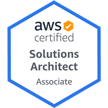

## Welcome

I have over 23 years of experience working in both internal support departments and technical architecture teams. In that time, I have worked up from 1st and 2nd line support on an IT helpdesk through to my current role as a Cloud Solution Architect, giving me a wide experience in many aspects of IT support, architecture and consultancy.

My main skills now are in cloud technologies - mainly AWS, GCP, Azure, smaller vCloud based providers as well as hybrid solutions such as Azure Stack. I use my expertise to offer architecture and consultancy to external clients looking to solution, design and implement in these environments, and use my knowledge and experience to meet the client’s requirements, on budget and on time.

I also have a complete background in Microsoft operating systems, networking and general 3rd and 4th line support calls, allowing me to troubleshoot or workaround issues as they arise. Since November 2021 I have been working at Secure Bubble as a freelancer to directly help clients with technical architecture and consultancy as well as hands on DevOps engineering and support.

If you're interested in my services, please drop me a note through my email, through [Upwork](https://www.upwork.com/freelancers/~0107c61d9ce789e34f) or via [Linked In](https://www.linkedin.com/in/antonygrace/)

### Technical Skills

- **AWS** - over 6 years experience designing and deploying IaaS, PaaS and cloud native solutions for multiple clients, including financial, pharamceutical and government clients.
- **Azure** - designed and implemented IaaS and PaaS solutions for public sector, defense and commercial clients.
- **GCP** - automated IaaS deployments + discussions with organisations for machine learning / AI platforms.
- **vCloud** - over 8 years experience working with multiple vCloud providers, designing and deploying IaaS solutions.
- **Automation** - extensive use of AWS Developer Tools, Azure DevOps, Terraform, Powershell, Python, Lambda and other tools used to automate deployment of resources using CI/CD and IaC principals.
- **Active Directory** - over 21 years experience designing and implementing Active Directory forests, including a fully automated deployment using IaC principals.
- **Certificate Services** - over 5 years designing and implementing PKI solutions through Active Directory Certificate Services and OpenSSL.

### Accreditations

### Contact Details

**Antony Grace**
_Secure Bubble_
+44 (0)7841 636266
[antony@securebubble.co.uk](mailto:antony@securebubble.co.uk)
