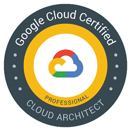

## Welcome

I have over 22 years of experience working in both internal support departments and technical architecture teams. In that time, I have worked up from 1st and 2nd line support on an IT helpdesk through to my current role as a Cloud Architect, giving me a wide experience in many aspects of IT support, architecture and consultancy.

My main skills now are in cloud technologies - mainly AWS, GCP, Azure, smaller vCloud based providers as well as hybrid solutions such as Azure Stack. I use my expertise to offer architecture and consultancy to external clients looking to solution, design and implement in these environments, and use my knowledge and experience to meet the client’s requirements, on budget and on time.

I also have a complete background in Microsoft operating systems, networking and general 3rd and 4th line support calls, allowing me to troubleshoot or workaround issues as they arise. My main focus currently with BlueLab is helping to deliver proof of concept and MVP environments within the AWS ecosystem.

If you're interested in my services, please drop me a note through my email or via [Linked In](https://www.linkedin.com/in/antonygrace/)

### Technical Skills

- **AWS** - over 4 years experience designing and deploying IaaS, PaaS and cloud native solutions for multiple clients, including financial, pharamceutical and government clients.
- **Azure** - designed and implemented IaaS and PaaS solutions for public sector, defense and commercial clients.
- **GCP** - initial discussions with government organisations for machine learning / AI platforms.
- **vCloud** - over 7 years experience working with multiple vCloud providers, designing and deploying IaaS solutions.
- **Automation** - extensive use of Terraform, Powershell, Lambda and other tools used to automate deployment of resources using IaC methodologies.
- **Active Directory** - over 20 years experience designing and implementing Active Directory forests, including a fully automated deployment using IaC principals.
- **Certificate Services** - over 4 years designing and implementing PKI solutions through Active Directory Certificate Services and OpenSSL.

### Accreditations

### Contact Details

**Antony Grace**
_ARG Consultancy Ltd_
+44 (0)7841 636266
[antony@arg-consultancy.co.uk](mailto:antony@arg-consultancy.co.uk)
